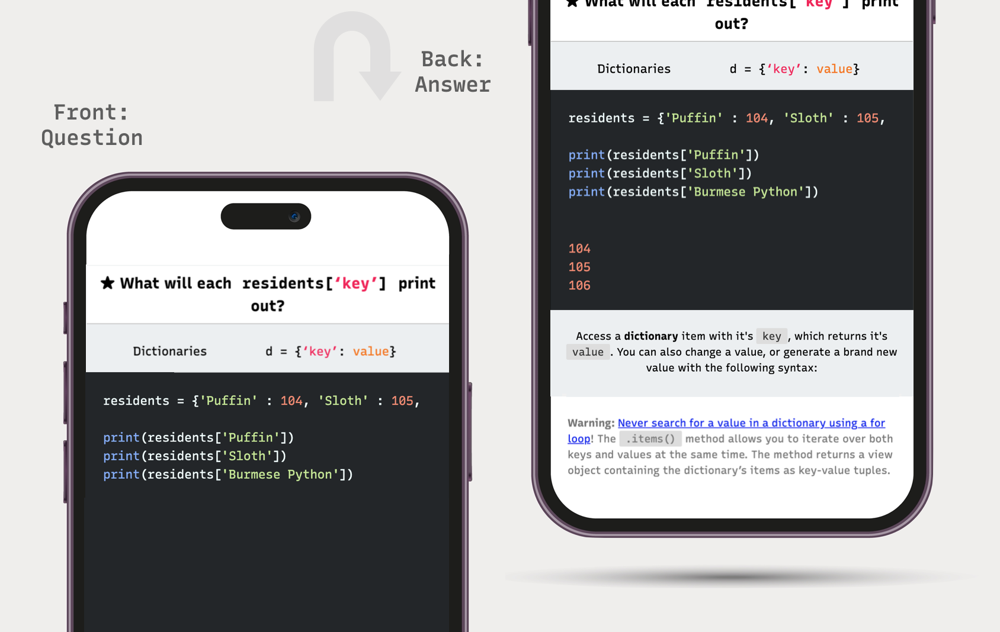

# Anki themes
## Learning to code with Anki — themes, cards, templates and syntax highlighting

Want to learn how to code?

Anki helps you learn and remember quickly. The default cards aren't great for programming, so these flashcards and themes make it fun to learn.

- Suitable for all learning levels
- Perfect for frontend and backend programmers
- Popular languages supported
- Add color to your code
- Fully customisable (create your own themes and cards!)

Are you looking to master **html**, **css**, **javascript**, **php**, **python**, **R** — or just getting started? If you're new to Anki, [read these guides first](#inspiration); otherwise ... let's begin!

## Keep it simple, stupid!

> 100 cards with [one idea](https://github.com/badlydrawnrob/anki/issues/41)&nbsp; >&nbsp; 10 cards with 100 ideas

Simple is better. If you only had 280 characters, what would you say? It's good practice to write your flashcards like you'd write code; as clear as possible. Imagine you're stupid, writing for your stupid future self — when you look back on your flashcards, they'll make sense.

- One idea per card
- Trim the fat (less is more)
- Keep it relevant (reduce cognitive load)

A card stuffed with facts will overload the brain. I imagine you're trying to learn:

- A theme, or idea
- A function, or code snippet
- Syntax, or high-level documentation

So, unless its a super hard question, if you're spending more than a minute reviewing each card — reduce, reduce, reduce. Simplify it!

## Cards

There's two types of cards to choose from:

1. **[Simple](./source/docs/simple/index.md)**
    - What's the answer?
    - What does this syntax do?
2. **[Missing!](./source/docs/missing/index.md)**
    - A question with a `[…]` word
    - A question with a `[missing]` word

## Add color to your code

### Basic syntax highlighting

You can mark any inline `<code>` with **bold** or _**italic**_ buttons in the Anki editor for [basic syntax highlighting](./source/docs/highlight/index.md#basic-syntax-highlighting) (or the equivalent HTML tags).

### Full syntax highlighting (Markdown)

> Life is better in full colour!

Anki themes come in light and dark, with [full syntax highlighting](./source/docs/highlight/index.md#full-syntax-highlighting):

- **Starter themes**
    - [Monokai](https://www.monokai.pro)
    - [Solarized light](https://ethanschoonover.com/solarized/)
- **[Create your own colour theme](./source/docs/highlight/index.md#customising-themes)**

Once you've got the basics down, you can get _really_ fancy with offline `markdown->html`, custom cards, and [more ...](./source/docs/highlight/index.md#the-professional-way-)

## Quick start

1. Download the [latest deck (`.apkg`)](https://github.com/badlydrawnrob/anki/releases)
2. Open [Anki](https://apps.ankiweb.net). Select `File > Import ...`
3. Import the deck
4. Add a card
5. Select `Anki theme` type
6. Get creative!

Next, you'll probably want to [add some pretty colors](./source/docs/highlight/index.md#basic-syntax-highlighting).

## The professional way ...

If you'd like to:

- Highlight your code blocks offline
- Convert Markdown to HTML automatically
- Select your theme colors
- Create custom cards

Then [enter the world](./source/docs/advanced/index.md) of the professional developer!

## Why Anki Themes instead of a plugin?

I've spent a lot of time so you can:

- Use Anki themes as they are ...
- Use the excellent `Markdown > HTML` workflow
- Customise the css to your hearts content.

Works on all platforms: [AnkiMobile](http://ankisrs.net/docs/AnkiMobile.html), MacOS and [Android](https://github.com/ankidroid/Anki-Android).

There _are_ other plugins out there that are fun to use, but [beware of dependency hell](./source/docs/error/index.md)!

## Be careful when ...

### Upgrading your deck

> ⚠️ **Always backup your deck** before installing a new version!

I try to stick to **major.minor.patch** [semantic versioning](http://semver.org), so updates don't break existing cards. Anki makes this tricky, so view commits for any major changes to the theme.

### Creating your flashcards

> ⚠️ **Stick to [Common Markdown](https://commonmark.org/) or [safe HTML](https://en.wikipedia.org/wiki/HTML_sanitization)** to [avoid unintended consequences in Anki](https://github.com/badlydrawnrob/anki/issues/27).

### Formatting problems

> ⚠️ If you're having formatting problems, make sure you're **[following the guide](./source/docs/highlight/index.md#full-syntax-highlighting)** and clicking `☰ -> Edit html` in the editor, then enter plain html. Many [editors](https://en.wikipedia.org/wiki/WYSIWYG) break formatting when you `copy->paste` text, or add junk to the html.

## Licensed under MIT

Anki themes are licensed under the [MIT Open Source License](./license.md)

## Thanks to ...

### Inspiration

I've had a lot of inspiration from [Anki essentials](http://alexvermeer.com/anki-essentials/), [Janki method](http://www.jackkinsella.ie/2011/12/05/janki-method.html), [Enduring CSS](http://ecss.io) component naming conventions, [@mdo code guide](http://codeguide.co/) and [@cbracco](https://github.com/cbracco) ... so, thanks!
