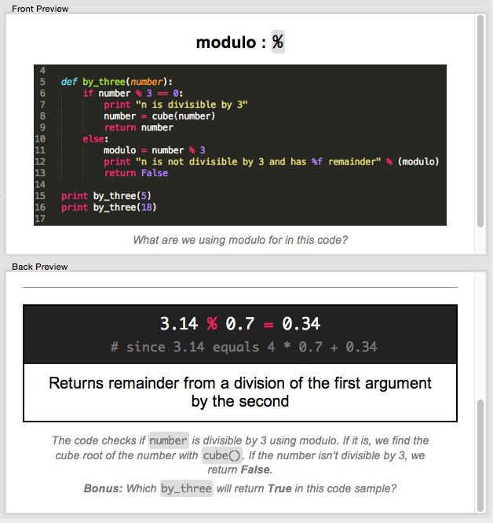

# Anki theme
## Anki themes, cards, templates for programming

Want to learn how to code? This Anki programming theme will help make your Anki development decks a little more fun to work with. Inspired by the excellent [Janki method](http://www.jackkinsella.ie/2011/12/05/janki-method.html), it's perfect for front-end and back-end programmers, beginner to experienced.

The template is built in html and css, with [syntax highlighting](./themes/styles/README.md) for inline code and code blocks using the beautiful `Monokai` and `Tomorrow` themes (I personally use these in [Sublime Text](http://www.sublimetext.com)). Supports developer languages such as **html**, **css**, **python**, **ruby**, **php**, **jquery**, **javascript** and whatever else you want to throw at it!

*Anki theme card #01 preview image*

## Card Types
There are currently two types of card, a simple card and a complex card. Both share the `themes/styles/main.css` file.

1. **[Simple](./themes/simple/README.md)**
  - A basic question/answer card: e.g. What is the shortcut for `X`?
2. **[Complex](./themes/complex/README.md)**
  - A more fully-rounded set of cards: an simple question, a symbol question and a puzzle question. Very flexible.

## Styling fields, inline code fields and code blocks

I've included some nice default styles for code; some fields will be automatically wrapped in `<code>` so all you need to do is add the symbol, class or function. The main `(code blocks)` need to be wrapped in a `<pre><code>`.

- **[Anki syntax highlighting and themes](./themes/styles/README.md)**

## Notes

I'm trying to keep updates from breaking existing cards, but unfortunately with Anki's structure this can be tricky. View commits for any major changes to the card's structure.
