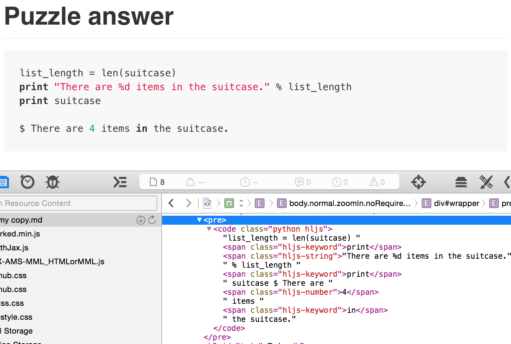

# Anki theme: Styles
## Tomorrow light and Monokai

### Less

I'm using `Less` to generate the `css/main.css` file — refer to code and comments there. Quickly change the colour scheme by changing or creating your own variables in `less/theme.less` and recompiling the css file.

## Basic styling

For basic styling of your html, css, python or your programming language of choice, you can use simple [HTML5 tags](https://developer.mozilla.org/en/docs/Web/HTML/Element) to add colour to your code.

- Default colour is white
- `<b>` or `<strong>` for major symbols (`if`, `and`, `>=`, `print` etc)
- `<i>` or `<em>` for an `int` or `float`
- `<s>` or `<u>` for a `string`
- `<span>` or `<sup>` for minor highlights (`function`, `class`)
- `<var>` or `<sub>` for minor higlights (`args`, `variables`)
- `<small>` for `# comments`.

- `<q>` wildcard (could be used for css `class` for instance)
- `<mark>` wildcard (could be used for a specific `highlight`)

These are also handy in `<pre><code>` blocks, as you can highlight specific syntax that you're studying for clarity.


## Super-charged automatic syntax highlighting



*Quickly generate syntax highlighting with Marked App*

Styling our code with HTML5 tags is pretty efficient with the Anki wysiwyg, but can get a little tedious when working with larger code blocks. **Enter [highlight.js](https://highlightjs.org/)**! Using javascript within Anki theme cards [can be problematic](http://ankisrs.net/docs/manual.html#javascript), so instead we can use ***highlight.js*** with a third-party tool; copy and paste the results; then style them with CSS.

### Using the highlight.js theme:

To use the theme you'll need to know about [fenced code blocks](https://help.github.com/articles/github-flavored-markdown/#fenced-code-blocks) with Markdown. They look something like this:

<pre><code>```
def function(args):
  pass
```</code></pre>

You can also specify a language:

<pre></code>```less
.class {
    color: #fff;
    .inner-class {
        color: #000;
    }
}
```</code></pre>

1. Get the [Marked App](http://marked2app.com/help/Special_Features/For_Programmers.html) which works with any editor for Mac. If you're on Linux or PC, you can use an [any markdown editor that utilises highlight.js](http://jbt.github.io/markdown-editor/).
2. Write your code in Markdown using a [fenced code block](https://help.github.com/articles/github-flavored-markdown/#fenced-code-blocks).
3. View the preview in Marked. The syntax should be detected automatically, but you can specify a language if you prefer.
4. The quickest way to grab the `highlight.js` code we need is to:
  - View the source code with *inspect element*
  - Remove the `<pre>` and `<code>` inline styles: in console type `$('pre, code').removeAttr('style');` ([screenshot here](../../img/marked-app-console.png))
    - Alternatively you can do this manually after *step 5* below
5. Copy and paste into `Key point (code block)` or `Puzzle answer (code block)` fields
   - Including everything from `<pre>` to `</pre>`

It's wise to keep a backup for easy editing, so I've added a `Markdown` field in both the [Simple](../simple/README.md) and [Complex](../complex/README.md) themes — here you can store raw markdown or a link to the original code (Github gist for example).

### Changing the theme:

1. Download your prefered theme from [highlight.js](https://highlightjs.org/download/)
2. Replace the `less/highlight.less` file with your chosen theme
  - Or, change the `less/variables.less` `@theme-dark-` colors
3. Recompile the `css/main.css`
4. Done!


##### Quick links

- [Anki Themes](../../README.md)
- [Simple Anki theme](../simple/README.md)
- [Complex Anki theme](../complex/README.md)
- [Deck example](../../deck/README.md)


